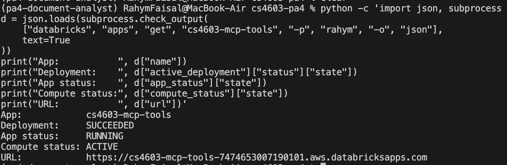

# CS4603 PA4 — Document Analyst

## Setup

```bash
uv sync --extra dev
cp .env.example .env
```

Set the Databricks host/token, serving LLM, Unity Catalog names, Vector Search endpoint/index,
source table, serving endpoint, and secret scope in `.env`. Never commit `.env`.

## Running locally

1. Upload `data/annual_report.pdf` to a Unity Catalog volume, for example
   `/Volumes/main/default/pa4/annual_report.pdf`.
2. In a Databricks notebook attached to a runtime that supports `ai_parse_document` and
   `ai_prep_search`, run:

   ```python
   from rag.ingest import ingest
   ingest(spark, "/Volumes/main/default/pa4/annual_report.pdf")
   ```

   This writes `SOURCE_TABLE`, enables Change Data Feed, creates or synchronizes the
   configured triggered Delta Sync index, and waits for it to become ready.
3. Run `pa4.ipynb` from the project root for retrieval-only, calculation-only, and combined
   examples. The graph uses the same managed index locally and after deployment.
4. Run the offline check with `uv run pytest -q`. Its six tests cover graph execution, both
   specialist paths, MCP stdio behavior, the owner-attributable net-income definition, client
   response parsing, and exponential-backoff recovery.

## Deployment

Create `SECRET_SCOPE` and store `DATABRICKS_HOST`, `DATABRICKS_TOKEN`, and
`DATABRICKS_MODEL` in it. Then run:

```bash
uv run python deployment/deploy.py
databricks serving-endpoints get pa4-document-analyst
```

The script logs a models-from-code LangGraph model with all local packages in `code_paths`,
registers it in Unity Catalog, and creates or updates `SERVING_ENDPOINT_NAME`. Credentials are
secret references; Vector Search identifiers are ordinary environment variables. The deployed
manual endpoint `pa4-document-analyst` is `READY`, serves
`cs4603.pa4.pa4_document_analyst` version 19, and routes 100% of traffic to that version.

The executed `pa4.ipynb` contains an HTTP 200 response and the three required deployed queries.
It reports FY2023 owner-attributable net income of ¥1,107 billion, 15% of 2.4 billion as
360 million, and FY2023 revenue of ¥16,910 billion increasing to ¥18,601 billion after 10%.
It also records a verified scaled-to-zero cold start of 43.486 seconds versus a 4.301-second
warm request; the following warm SDK requests took 3.954, 9.230, and 6.364 seconds.

## Design decisions

The graph plans before execution and routes each atomic step through a supervisor. Retrieval
and deterministic computation are isolated so prompts, failures, and evaluation can be tuned
independently. Both specialists return to the supervisor, which routes to synthesis only after
all steps finish. Dependencies can be injected, making graph behavior testable without cloud
services. Production construction instead uses the configured Databricks LLM, managed Vector
Search retriever, and MCP tools.


### Task 1.2 — Planner

1. The plan lays out dependent steps in order, and each specialist adds its output to step_results as it goes. Since the MCP node gets all the earlier results in its prompt, a growth calculation later in the chain can pull in a revenue figure that was retrieved earlier. The downside is that these dependencies are just text, not typed references, so ambiguous units or multiple similar-looking values can still trip things up.
2. Replanning helps when retrieval comes back with "not found" or hits an unexpected unit, but it's not free: you pay in extra LLM calls, added latency, higher cost, and some risk of the plan drifting off course. For a short, fixed report like this one, it's usually better to just run a 2 to 5 step plan rather than replan. Where replanning actually earns its keep is a case like "find operating margin" failing, since the system would then need to break that into separate steps for operating income and revenue.

### Task 1.3 — Supervisor

1. When a lookup gets misrouted to MCP, you typically end up with a missing or fabricated tool input. Send arithmetic to RAG by mistake, and you'll usually just get "not found." You can catch these through route traces, validating tool calls, checking for empty retrievals, and confirming result types. Recovery generally means retrying once with the other specialist, or having an LLM validator step in to reclassify the failed step.
2. A ReAct agent works fine for open-ended tasks that don't need many tools. The supervisor setup starts to pay off once workflows regularly combine retrieval with calculation: routing becomes observable, prompts stay narrower and more focused, deterministic math gets enforced properly, and each specialist can be evaluated on its own.

### Task 1.4 — RAG Agent

1. Retrieving for a single atomic step strips out unrelated clauses and tends to improve embedding similarity. Revenue retrieval, for instance, isn't diluted by CAGR-related wording. That said, you can lose useful context, like the company, year, or units, if the planner ends up making the step too terse.
2. The fix is to rewrite the step using entities and constraints pulled from the original question and any earlier results, something like "Meridian Motor Corporation FY2023 consolidated net revenue, Japanese yen." From there, query expansion, metadata filters, and hybrid or reranked retrieval are all further ways to sharpen it.

### Task 2.1 — Model Definition

1. Models-from-code rebuilds the model fresh inside a clean serving container. Anything that only exists on your laptop, whether that's modules, files, running processes, or databases, simply isn't there anymore, which is why you get import errors or connection failures. That's why the model definition and code_paths need to carry all the actual code, while anything external should rely on stable service endpoints and environment configuration instead.
2. Using an external index keeps things fresh and keeps both the artifact and cold start times small, but it comes with tradeoffs: network latency, authentication overhead, quota limits, and one more thing that can go down. Baking the corpus in instead is fast and self-contained, but it bulks up the artifact and cold start, and you'll need a new model version every time the documents change.

### Task 2.3 — Serving Endpoint

1. The authentication for calling the endpoint itself is a separate thing from whatever credentials the code inside the container uses. Since the running graph needs to make outbound calls to the serving LLM and Vector Search, it needs its own explicit credentials or a supported service identity to do that.
2. When Databricks provisions a new served entity, it waits until that entity is ready before shifting traffic over. Existing requests keep running on the old replica the whole time, while new requests get routed based on the endpoint configuration. Waiting for readiness this way stops traffic from hitting an uninitialized version, though clients should still be built to retry on transient 503s just in case.

### Task 3.2 — Client

1. Exponential backoff helps avoid a pile-up of synchronized retries and gives an endpoint that's scaling or rate-limiting more room to recover as time goes on. Fixed-interval retries don't have that benefit, since they can keep landing in the same busy window over and over.
2. Too many retries end up multiplying traffic, cost, queueing, and the latency users actually notice, especially during an outage. With enough users doing this at once, it can actually stop the system from recovering at all. That's why production clients should cap both the number of attempts and the total time spent retrying, and it's usually worth adding jitter or circuit breaking on top of that.
3. Streaming earns its keep when perceived latency actually matters, like showing the opening sentences of a long financial explanation as it comes in on a chat UI. ask() is the simpler choice for scripts that just need one full value back before moving on. And it's worth noting this endpoint might legitimately just return everything in a single chunk anyway.

### Bonus A — GitHub Actions CI/CD

1. Deployment runs only from `main` because that branch is the reviewed source of truth; feature
   branches must not mutate the shared production endpoint. The workflow also supports manual
   dispatch for controlled ad-hoc deployments.
2. A production quality gate would evaluate a versioned held-out dataset and compare the
   candidate with the current endpoint on groundedness, numerical accuracy, latency, and safety.
   The deployment job should reject any candidate that falls below defined thresholds.

### Bonus A — Evidence

The verified workflow ran Ruff and all six tests before deploying. GitHub Actions run
`29352336749` completed successfully and promoted manual endpoint version 19.



You can check the workflow on Github:
https://github.com/RahymFaisalKhan/cs4603-pa4/actions

### Bonus B — `databricks-agents`

1. `agents.deploy()` automatically provisions an Agent Framework endpoint and Review App and
   integrates tracing and feedback, while the manual `WorkspaceClient` route provides more
   direct control over served entities, traffic, environment variables, and secret wiring.
2. Human feedback should be joined with traces, categorized by retrieval, routing, or
   calculation failure, added to a versioned evaluation set, and used to improve prompts or
   retrieval. A later candidate should pass that evaluation set before deployment.

The raw LangGraph state is not a standardized Agent Framework response. To keep the same graph
while satisfying the current SDK, `deployment/agent_chat_model.py` wraps it in MLflow's
`ChatAgent` interface. The model accepts `list[ChatAgentMessage]` and returns a
`ChatAgentResponse` containing the final answer as an assistant message, plus the plan and step
results in `custom_outputs`. MLflow derives the compatible signature from this interface, and
Databricks recognizes the endpoint task as `agent/v2/chat`; the model does not reduce the graph
to an untyped plain-string `PythonModel`.

### Bonus B — Evidence

- Agent Framework endpoint: `agents_cs4603-pa4-pa4_document_analyst`, state `READY`.
- Unity Catalog model: `cs4603.pa4.pa4_document_analyst`, version 12.
- Auto-generated Review App:
  `https://dbc-01190470-5ed4.cloud.databricks.com/ml/review-v2/4f6c042eb90f4136a0e16b6de0b00488/chat`.
- MLflow experiment:
  `https://dbc-01190470-5ed4.cloud.databricks.com/ml/experiments/1306660282575833`.
- Retrieval trace `tr-7c56786093e210b3b5ac365cd8773f5f`, calculation trace
  `tr-c7370aee42cb30cc592233be524402a0`, and combined trace
  `tr-a729247b35812c589b41254e1c5cfe49` all have `TraceStatus.OK` and a persisted
  human `user_rating` of 1.0.

### Bonus C — Standalone MCP service

1. Moving MCP out of the model container enables independent scaling, releases, access policy,
   reuse, and monitoring. It introduces network latency, OAuth failures, and a separate
   availability dependency.
2. The hosted service is protected by Databricks App authentication. Model Serving uses the
   least-privilege service principal `cs4603-pa4-mcp-client`, which has only `CAN_USE`; its OAuth
   credentials are stored in the `cs4603-deploy` secret scope. Private networking and explicit
   authorization should be added where available.
3. Bundling is preferable for a small stable toolset that should deploy atomically with one
   agent. A separate service is preferable when several agents share the tools or the tools
   require their own release cadence, security boundary, or scaling policy.

### Bonus C — Evidence

Manual Model Serving endpoint pa4-document-analyst is READY and routes 100% of traffic to Unity Catalog model version 19. Scale-to-zero is enabled.


The Databricks App `cs4603-mcp-tools` is running with active compute and serves the protected
streamable-HTTP route at
`https://cs4603-mcp-tools-7474653007190101.aws.databricksapps.com/api/mcp`. Endpoint version 19
uses this URL with OAuth secret references. A calculation returned HTTP 200 and 360 million;
when the app was stopped, the same dependency failed with `503 Service Unavailable`, and it
recovered after the app restarted. This proves that deployed calculations use the standalone
HTTP service rather than the bundled stdio fallback.
