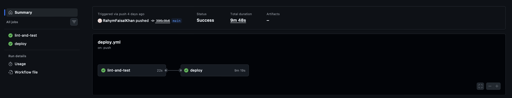

# CS4603 PA4 — Document Analyst (Student Submission)

> This is your **submission file**. `README.md` is the assignment spec — this document is where you write up your work.
>
> - Document how to set up, run, and deploy your Document Analyst so a TA can reproduce your results.
> - **Answer every ANALYSIS QUESTION** from the assignment in the sections below.
> - Replace every `TODO` before submitting.
> - Keep it self-contained: a reader should be able to follow this file top-to-bottom —
>   setup → ingest → run → deploy → results — without opening the assignment spec.

## Setup

```bash
uv sync --extra dev
cp .env.example .env
```

Set the Databricks host/token, serving LLM, Unity Catalog names, Vector Search endpoint/index,
source table, serving endpoint, and secret scope in `.env`. Never commit `.env`.

## Running locally

1. Upload `data/annual_report.pdf` to a Unity Catalog volume, for example
   `/Volumes/main/default/pa4/annual_report.pdf`.
2. In a Databricks notebook attached to a runtime that supports `ai_parse_document` and
   `ai_prep_search`, run:

   ```python
   from rag.ingest import ingest
   ingest(spark, "/Volumes/main/default/pa4/annual_report.pdf")
   ```

   This writes `SOURCE_TABLE`, enables Change Data Feed, creates or synchronizes the
   configured triggered Delta Sync index, and waits for it to become ready.
3. Run `pa4.ipynb` from the project root for retrieval-only, calculation-only, and combined
   examples. The graph uses the same managed index locally and after deployment.
4. Run the offline check with `uv run pytest -q`. Its six tests cover graph execution, both
   specialist paths, MCP stdio behavior, the owner-attributable net-income definition, client
   response parsing, and exponential-backoff recovery.

## Deployment

Create `SECRET_SCOPE` and store `DATABRICKS_HOST`, `DATABRICKS_TOKEN`, and
`DATABRICKS_MODEL` in it. Then run:

```bash
uv run python deployment/deploy.py
databricks serving-endpoints get pa4-document-analyst
```

The script logs a models-from-code LangGraph model with all local packages in `code_paths`,
registers it in Unity Catalog, and creates or updates `SERVING_ENDPOINT_NAME`. Credentials are
secret references; Vector Search identifiers are ordinary environment variables. The deployed
manual endpoint `pa4-document-analyst` is `READY`, serves
`cs4603.pa4.pa4_document_analyst` version 19, and routes 100% of traffic to that version.

The executed `pa4.ipynb` contains an HTTP 200 response and the three required deployed queries.
It reports FY2023 owner-attributable net income of ¥1,107 billion, 15% of 2.4 billion as
360 million, and FY2023 revenue of ¥16,910 billion increasing to ¥18,601 billion after 10%.
It also records a verified scaled-to-zero cold start of 43.486 seconds versus a 4.301-second
warm request; the following warm SDK requests took 3.954, 9.230, and 6.364 seconds.

## Design decisions

The graph plans before execution and routes each atomic step through a supervisor. Retrieval
and deterministic computation are isolated so prompts, failures, and evaluation can be tuned
independently. Both specialists return to the supervisor, which routes to synthesis only after
all steps finish. Dependencies can be injected, making graph behavior testable without cloud
services. Production construction instead uses the configured Databricks LLM, managed Vector
Search retriever, and MCP tools.

---

## Analysis Questions

> Answer in your own words. Each question is copied from the assignment so you don't have to flip back.

### Task 1.2 — Planner
1. What happens when the planner produces steps that depend on each other (e.g., step 3 needs the result of step 1)? How does your architecture handle this?
   - The plan lays out dependent steps in order, and each specialist adds its output to
     `step_results` as it goes. Since the MCP node gets all the earlier results in its prompt,
     a growth calculation later in the chain can pull in a revenue figure retrieved earlier.
     The downside is that these dependencies are text, not typed references, so ambiguous units
     or multiple similar-looking values can still cause errors.
2. Would a replanning step after each execution improve or hurt performance for this use case? Justify with an example.
   - Replanning helps when retrieval returns "not found" or an unexpected unit, but adds LLM
     calls, latency, cost, and some risk of plan drift. For a short, fixed report it is usually
     better to run the initial two-to-five-step plan. Replanning earns its keep when a request
     such as "find operating margin" fails and must be split into operating-income and revenue
     retrieval steps.

### Task 1.3 — Supervisor
1. Your supervisor makes a routing decision per step. What is the failure mode if it misroutes? How would you detect and recover from a misroute?
   - A lookup misrouted to MCP typically produces a missing or fabricated tool input, while
     arithmetic sent to RAG usually returns "not found." Route traces, tool-call validation,
     empty-retrieval checks, and result-type checks expose these failures. Recovery can retry
     once with the other specialist or use an LLM validator to reclassify the failed step.
2. Compare this supervisor pattern with a single ReAct agent that has access to all tools. When is the supervisor pattern worth the added complexity?
   - A ReAct agent works well for open-ended tasks with few tools. The supervisor pays off when
     workflows regularly combine retrieval and calculation: routing becomes observable, prompts
     stay narrow, deterministic math is enforced, and each specialist can be evaluated alone.

### Task 1.4 — RAG Agent
1. The RAG agent retrieves for a single decomposed step, not the full user query. How does this affect retrieval quality compared to retrieving for the original question?
   - Retrieving for one atomic step removes unrelated clauses and tends to improve embedding
     similarity; revenue retrieval, for example, is not diluted by CAGR wording. It can lose
     useful company, year, or unit context if the planner makes the step too terse.
2. If the planner produces a vague step like "find relevant financial data," how would you improve the retrieval query before sending it to the vector store?
   - Rewrite the step with entities and constraints from the original question and earlier
     results, such as "Meridian Motor Corporation FY2023 consolidated net revenue, Japanese
     yen." Query expansion, metadata filters, and hybrid or reranked retrieval can sharpen it
     further.

### Task 2.1 — Model Definition
1. Why does `models-from-code` require a self-contained file? What breaks if you reference external state (e.g., a database running only on your laptop)?
   - Models-from-code rebuilds the model inside a clean serving container. Laptop-only modules,
     files, processes, and databases are absent, causing import or connection failures. The
     model definition and `code_paths` therefore carry the code, while external dependencies
     use stable service endpoints and environment configuration.
2. Your model calls a managed Vector Search index at inference time rather than embedding documents into the container image. What are the tradeoffs (freshness, cold-start size, latency, failure modes) of querying an external index vs. baking the corpus into the model artifact?
   - An external index stays fresh and keeps the artifact and cold start small, but adds network
     latency, authentication, quotas, and another availability dependency. A baked corpus is
     fast and self-contained, but increases artifact size and cold-start time and requires a new
     model version whenever documents change.

### Task 2.3 — Serving Endpoint
1. Why must you pass `DATABRICKS_TOKEN` as an environment variable to the endpoint, even though it's already authenticated to serve models?
   - Authentication for calling the endpoint is separate from the credentials used by code
     inside its container. The running graph makes outbound calls to the serving LLM and Vector
     Search, so it needs explicit credentials or a supported service identity.
2. What happens to in-flight requests when you deploy a new model version to the same endpoint? How does Databricks handle the transition?
   - Databricks provisions the new served entity and waits until it is ready before shifting
     traffic. Existing requests continue on the old replica while new requests follow the
     endpoint configuration. Clients should still retry transient 503 responses.

### Task 3.2 — Client
1. Why is exponential backoff better than fixed-interval retries for a model serving endpoint?
   - Exponential backoff reduces synchronized retry storms and gives a scaling or rate-limited
     endpoint progressively more time to recover. Fixed retries can repeatedly hit the same busy
     interval.
2. Your client has a `max_retries` parameter. What is the danger of setting it too high in a production system with many concurrent users?
   - Excessive retries multiply traffic, cost, queueing, and user-visible latency during an
     outage. Across enough users they can prevent recovery. Production clients should cap both
     attempts and total elapsed time and normally add jitter or circuit breaking.
3. When would you choose `ask_streaming()` over `ask()`? Give a concrete UX example.
   - Streaming is useful when perceived latency matters, such as displaying the opening
     sentences of a long financial explanation in a chat UI. `ask()` is simpler for scripts
     that need one complete value before continuing. This endpoint may legitimately return one
     full chunk.

### Bonus A — CI/CD (if attempted)
1. Why should the deploy step only run on `main` and not on feature branches?
   - `main` is the reviewed source of truth; feature branches must not mutate the shared
     production endpoint. The workflow also supports manual dispatch for controlled ad-hoc
     deployments.
2. What would you add to this pipeline to prevent deploying a model that performs worse than the current version? Describe the gate.
   - Evaluate a versioned held-out dataset and compare the candidate with the current endpoint
     on groundedness, numerical accuracy, latency, and safety. Reject any candidate below the
     defined thresholds.

The verified workflow ran Ruff and all six tests before deploying. GitHub Actions run
`29352336749` completed successfully and promoted manual endpoint version 19.


### Bonus B — `databricks-agents` SDK (if attempted)
1. Compare the `agents.deploy()` approach with the manual MLflow + CLI approach from Part 2. What control do you gain or lose with each?
   - `agents.deploy()` automatically provisions an Agent Framework endpoint and Review App and
     integrates tracing and feedback. The manual `WorkspaceClient` route provides more direct
     control over served entities, traffic, environment variables, and secret wiring.
2. The Review App enables human feedback collection. How would you use this feedback to improve the agent over time? Describe a concrete feedback loop.
   - Join human feedback with traces, categorize retrieval, routing, or calculation failures,
     add them to a versioned evaluation set, and use them to improve prompts or retrieval. A
     later candidate must pass that evaluation set before deployment.

The raw LangGraph state is not a standardized Agent Framework response. To keep the same graph
while satisfying the current SDK, `deployment/agent_chat_model.py` wraps it in MLflow's
`ChatAgent` interface. The model accepts `list[ChatAgentMessage]` and returns a
`ChatAgentResponse` containing the final answer as an assistant message, plus the plan and step
results in `custom_outputs`. MLflow derives the compatible signature from this interface, and
Databricks recognizes the endpoint task as `agent/v2/chat`.

Verified evidence:

- Agent Framework endpoint: `agents_cs4603-pa4-pa4_document_analyst`, state `READY`.
- Unity Catalog model: `cs4603.pa4.pa4_document_analyst`, version 12.
- Review App:
  `https://dbc-01190470-5ed4.cloud.databricks.com/ml/review-v2/4f6c042eb90f4136a0e16b6de0b00488/chat`.
- MLflow experiment:
  `https://dbc-01190470-5ed4.cloud.databricks.com/ml/experiments/1306660282575833`.
- Retrieval trace `tr-7c56786093e210b3b5ac365cd8773f5f`, calculation trace
  `tr-c7370aee42cb30cc592233be524402a0`, and combined trace
  `tr-a729247b35812c589b41254e1c5cfe49` all have `TraceStatus.OK` and a persisted
  human `user_rating` of 1.0.

### Bonus C — Standalone MCP server (if attempted)
1. You moved the MCP server out of the model container. What did you gain (scaling, deployment, security, observability) and what new failure modes did you introduce (network, auth, latency, availability)?
   - Moving MCP out of the model container enables independent scaling, releases, access
     policy, reuse, and monitoring. It introduces network latency, OAuth failures, and a
     separate availability dependency.
2. The remote MCP server now needs its own authentication. How would you secure it so that only your serving endpoint — not the public internet — can call the tools?
   - The hosted service is protected by Databricks App authentication. Model Serving uses the
     least-privilege service principal `cs4603-pa4-mcp-client`, which has only `CAN_USE`; its
     OAuth credentials are stored in the `cs4603-deploy` secret scope. Private networking and
     explicit authorization should be added where available.
3. When is bundling the tools in the container (Part 1) the *better* choice, and when is a separately deployed tool service (Bonus C) worth the extra moving parts?
   - Bundling is preferable for a small, stable toolset that should deploy atomically with one
     agent. A separate service is preferable when several agents share the tools or the tools
     require their own release cadence, security boundary, or scaling policy.

The manual Model Serving endpoint `pa4-document-analyst` is `READY`, routes 100% of traffic to
Unity Catalog model version 19, and has scale-to-zero enabled.



The Databricks App `cs4603-mcp-tools` is running with active compute and serves the protected
streamable-HTTP route at
`https://cs4603-mcp-tools-7474653007190101.aws.databricksapps.com/api/mcp`. Endpoint version 19
uses this URL with OAuth secret references. A calculation returned HTTP 200 and 360 million;
when the app was stopped, the same dependency failed with `503 Service Unavailable`, and it
recovered after the app restarted. This proves that deployed calculations use the standalone
HTTP service rather than the bundled stdio fallback.
